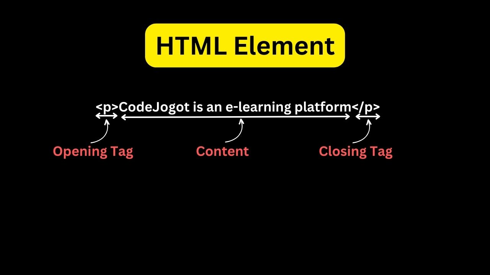

# Chapter-01: Environment Setup, HTML Elements, Attributes, Text Formatting

- [What is Programming Lanuage](#what-is-programming-lanuage)
- [What is Program, Programming & Programmer](#what-is-program-programming--programmer)
- [What is IDE](#what-is-ide)
- [Difference between Web Design & Web Development
  ](#difference-between-web-design--web-development)
- [What is HTML?](#what-is-html)
- [History of HTML](#history-of-html)
  - [Founder of HTML](#founder-of-html)
  - [The World’s First Website](#the-worlds-first-website)
- [What is CSS?](#what-is-css)
  - [Founder of CSS](#founder-of-css)
- [Environment Setup](#environment-setup)
- [HTML Basics](#html-basics)
- [HTML Elements](#html-element)
- [HTML Attributes](#html-attributes)
- [HTML Style Attribute](#html-style-attribute)
- [HTML Text Formatting](#html-text-formatting)
- [Assignments for Chapter 01](#assignments-for-chapter-01)
- [How Web Works? (Optional for Right Now)](#how-web-works)

## What is Programming Lanuage

- যে ভাষা ব্যবহার করে মানুষ মানুষের সাথে কথা বলে, তাকে বলে Lanuage বা ভাষা। অপরদিকে যে ভাষা ব্যবহার করে মানুষ Computer এর সাথে কথা বলে তাকে বলা হয় Programming Lanuage বা প্রোগ্রামিং ভাষা।
- Computer 0 এবং 1 ছাড়া কোনকিছুই বুঝতে পারে না। তাই আমরা যে Code লিখি সেই কোডকে আসলে 0 এবং 1 Convert করতে হয়। আর এই কাজটি করে Interpreter এবং Compiler.
- Examples: C, C++, Java, Python, JavaScript, PHP etc.


## What is Program, Programming & Programmer

- একটি প্রোগ্রাম হল Insturctions এর তালিকা যা একটি
  নির্দিষ্ট কাজ সম্পন্ন করে এবং Computer দ্বারা Executed হয়। (A program is a list of instructions that is executed by a computer to accomplish a particular task.)
- এই Instructions তৈরি করাকেই প্রোগ্রামিং বলে। যে তৈরি করে তাকে প্রোগ্রামার বলে।

## What is IDE

- An Integrated Development Environment (IDE) is a software application that combines common software development tasks into a single application.
- Example: VS Code, Atom, Netbeans, Android Studio, Sublime Text, Code Blocks etc.

**Common Task of An IDE:**


## Difference between Web Design & Web Development

| **Criteria**   | **Web Design**                                                                                                          | **Web Development**                                             |
| -------------- | ----------------------------------------------------------------------------------------------------------------------- | --------------------------------------------------------------- |
| **Definition** | Designing the overall look & feel of the website, creating visual elements such as logos, icons, buttons, graphics etc. | Implementing the design into a functional website writing code. |
| **Tools**      | Adobe Photoshop, Adobe XD, Figma etc.                                                                                   | VS Code, Sublime Text, Atom etc.                                |
| **Skills**     | Design Principles, Layout Techniques, Color Theory, Typography, UI Design etc.                                          | HTML, CSS, JavaScript, ReactJS, PHP, Laravel etc.               |

## What is HTML?

- The full meaning of HTML is **_Hyper Text Markup Language_**. HTML হলো একটি _Markup language_.  
  HTML is used to build the **_STRUCTURE_** of the web pages.
- একটি ভাষা শিখতে যেমন বর্ণমালা দিয়ে শুরু করতে হয়, ঠিক তেমনি Web Developement শিখতেও HTML, CSS দিয়ে শুরু করতে হয়।
- এইচটিএমএল এর মার্ক আপ ট্যাগ সমূহ ব্যবহার করে ওয়েবপেজ এর বেসিক কাঠামো তৈরি করা হয়। কঙ্কাল যেমন মানুষের দেহ গঠন করে , তেমনি এইচটিএমএল একটি ওয়েবসাইটের কাঠামো তৈরি করে ।
- HTML কোনো প্রোগ্রামিং ল্যাংগুয়েজ নয় বরং একটি মার্কআপ ল্যাংগুয়েজ যা কতগুলো মার্কআপ ট্যাগ এর সমন্বয় গঠিত।
- HTML ফাইলের এক্সটেনশন **_.html_** অথবা **_.htm_** দিতে হয়।

## History of HTML

- ১৯৯১ সালে ব্রিটিশ পদার্থবিদ ও কম্পিউটার বিজ্ঞানী **টিম বার্নার্স-লি**, CERN(European Council for Nuclear Research) এ কর্মরত ছিলেন। ঐ সময় CERN এর কর্মীদের মাঝে বিভিন্ন Documents Share করার জন্য সর্বপ্রথম HTML আবিষ্কার করেন। পরবর্তীতে ১৯৯৩ সালে HTML 1.0 Officially Released করা হয়।
- ঐ সময় HTML এর ট্যাগ ছিল মাত্র ১৮ টা। বর্তমানে ১৪২ টা ট্যাগ আছে।
- HTML এর বিভিন্ন Versions and Release Year

| **Version** | **Release Year** |
| ----------- | ---------------- |
| HTML 1.0    | 1993             |
| HTML 2.0    | 1995             |
| HTML 3.0    | 1997             |
| HTML 4.0    | 1999             |
| HTML 5.0    | 2014             |

### Founder of HTML


### The World’s First Website

- To Visit the World's First Website: [Click Here](http://info.cern.ch/hypertext/WWW/TheProject.html)
- Screenshot:
  

## What is CSS?

- CSS (Cascading Style Sheet ) হল একটি Style Sheet Lanuage যা HTML এ লিখিত ডকুমেন্ট কীভাবে উপস্থাপিত ও সজ্জিত হবে তা নির্ধারণ করে। অর্থাৎ HTML দিয়ে Website এর Structure এবং CSS দিয়ে Design করা হয়।
- CSS File এর Extension হলো **_.css_**

## History of CSS

- CSS আসার আগে, যেকোনো ওয়েব ডকুমেন্ট (web document) এর কোনো style বা design ছিলোনা। মানে, যখন একটি ওয়েবসাইট বা ওয়েব পেজের মধ্যে ভিসিট করা হতো, তখন সেখানে কেবল **বিচ্ছিন্ন কিছু TEXT** ছাড়া কিছুই থাকতোনা। এই সমস্যার সমাধান করতে গিয়ে HTML `<style></style>` tag এর বিকাশ হলো। কিন্তু এরও কিছু সীমাবদ্ধতা থেকে গেলো।
- অবশেষে ১৯৯৪ সালে Håkon Wium Lie নামে একজন Computer Scientist CSS আবিষ্কার করেন। ১৯৯৬ সালে Officially CSS 1.0 Version Release করা হয়। তিনিও **টিম বার্নার্স-লি** এর মত CERN(European Council for Nuclear Research) এ কর্মরত ছিলেন।
- Version History:

| **Version** | **Release Year** |
| ----------- | ---------------- |
| CSS 1.0     | 1996             |
| CSS 2.0     | 1998             |
| CSS 3.0     | 1999 (Draft)     |

- CSS3 Single Version এ Released হয়নি, বরং বিভিন্ন Module এ Release হয়েছে। যেমনঃ
- ২০০১ সালে CSS3 তে Selector Level 3 আসে।
- ২০০২ সালে Box Model, Background, Borders আসে।
- ২০০৯ সালে আসে Media Queries, Transitions, Animation এবং Flexbox.
- ২০১১ সালে আসে Grid Layout, Multi Column Layout.

CSS এর Details Version History দেখতে [এখানে](https://www.w3.org/Style/CSS20/) ক্লিক করুন।

### Founder of CSS


## Environment Setup

- VS Code Download করতে [এখানে](https://code.visualstudio.com/) ক্লিক করুন।
- Windows এর জন্য নিচের দেখানো Marked Button এ ক্লিক করুন। Download এর পরে Install করুন।
  
- এরপর নিচের Extensions গুলো ইনস্টল করুন:
  - Auto Close Tag
  - Auto Rename Tag
  - Code Runner
  - IntelliSense for CSS class names
  - JavaScript Code Snippets
  - Live Preview
  - Live Server
  - Prettier - Code Formatter

**_Congratulations! you're ready to code now!_**

## HTML Basics

নিচে **HTML Basic Tags** এর একটি তালিকা টেবিল আকারে দেয়া হলো, যেখানে প্রতিটি tag এর বর্ণনা এবং উদাহরণ সংক্ষেপে উল্লেখ করা হয়েছে।

| HTML Tag      | Description                            | Example                                              |
|---------------|----------------------------------------|------------------------------------------------------|
| `<html>`      | পুরো HTML document কে wrap করে          | `<html lang="en"> ... </html>`                        |
| `<head>`      | Page এর metadata রাখে                   | `<head> ... </head>`                                  |
| `<title>`     | Browser tab এর title সেট করে            | `<title>My First Page</title>`                        |
| `<body>`      | Page এর main content থাকে               | `<body> ... </body>`                                  |
| `<h1>` to `<h6>` | Headings তৈরি করে (h1 সবচেয়ে বড়, h6 সবচেয়ে ছোট) | `<h1>Main Heading</h1>`                               |
| `<p>`         | Paragraph তৈরি করে                     | `<p>This is a paragraph.</p>`                         |
| `<a>`         | Hyperlink তৈরি করে, **href** attribute দিয়ে link দেয় | `<a href="https://example.com">Visit Example</a>`   |
| ``       | Image display করে, **src** ও **alt** attribute থাকে | ``          |
| `<ul>`        | Unordered list তৈরি করে                | `<ul><li>Item 1</li><li>Item 2</li></ul>`             |
| `<ol>`        | Ordered list তৈরি করে                  | `<ol><li>Item 1</li><li>Item 2</li></ol>`             |
| `<li>`        | List item তৈরি করে                     | `<li>List Item</li>`                                  |
| `<div>`       | Block-level container তৈরি করে         | `<div>Content here</div>`                             |
| `<span>`      | Inline container তৈরি করে              | `<span>Text here</span>`                              |
| `<br>`        | Line break তৈরি করে                    | `This is a line.<br>This is a new line.`              |
| `<hr>`        | Horizontal line তৈরি করে               | `<hr>`                                                |
| `<form>`      | User input নেয়ার জন্য form তৈরি করে   | `<form> ... </form>`                                  |
| `<input>`     | User এর data input এর জন্য             | `<input type="text" name="username">`                 |
| `<label>`     | Input field এর label দেয়               | `<label for="name">Name:</label>`                     |
| `<button>`    | Button তৈরি করে                        | `<button>Click Me</button>`                           |
| `<table>`     | Table তৈরি করে                         | `<table> ... </table>`                                |
| `<tr>`        | Table row তৈরি করে                     | `<tr> ... </tr>`                                      |
| `<th>`        | Table header তৈরি করে                  | `<th>Header</th>`                                     |
| `<td>`        | Table data cell তৈরি করে               | `<td>Data</td>`                                       |
| `<strong>`    | Text bold করতে ব্যবহার হয়              | `<strong>Bold Text</strong>`                          |
| `<em>`        | Text italic করতে ব্যবহার হয়            | `<em>Italic Text</em>`                                |
| `<link>`      | External resources (যেমন CSS) link করতে | `<link rel="stylesheet" href="style.css">`           |
| `<script>`    | JavaScript কোড বা external JS ফাইল যুক্ত করতে | `<script src="script.js"></script>`               |
| `<meta>`      | Metadata দেয়                           | `<meta charset="UTF-8">`                              |

### Explanation:
- **Structural Tags**: যেমন `<html>`, `<head>`, `<body>`, এগুলো একটি HTML document এর structure তৈরি করে।
- **Text Formatting Tags**: যেমন `<h1>` থেকে `<h6>`, `<p>`, `<strong>`, `<em>`, এগুলো বিভিন্ন ভাবে text কে format করতে ব্যবহার করা হয়।
- **Media and Links Tags**: যেমন `<a>`, ``, এগুলো link এবং image যুক্ত করতে ব্যবহৃত হয়।
- **Forms and Inputs**: যেমন `<form>`, `<input>`, `<label>`, এগুলো ব্যবহার করে user এর কাছ থেকে data collect করা যায়।
- **Lists and Tables**: যেমন `<ul>`, `<ol>`, `<table>`, এগুলো ordered ও unordered lists এবং টেবিল তৈরি করতে ব্যবহার করা হয়।

### Metadata কি?

**Metadata** হল এমন তথ্য যা একটি **HTML document** সম্পর্কে অতিরিক্ত তথ্য সরবরাহ করে। এটি browser এবং search engines কে document সম্পর্কে গুরুত্বপূর্ণ তথ্য জানাতে সাহায্য করে। সাধারণত **metadata** কে `<head>` tag এর ভিতরে রাখা হয় এবং এটি page এর title, character encoding, description, keywords ইত্যাদি সম্পর্কে তথ্য বহন করে।

#### উদাহরণ:

- **`<meta charset="UTF-8">`**: এটি character encoding সেট করে। **UTF-8** encoding এর মাধ্যমে বিভিন্ন ভাষার character গুলো সঠিকভাবে display করা যায়।
- **`<meta name="viewport" content="width=device-width, initial-scale=1.0">`**: এটি responsive design এর জন্য ব্যবহার করা হয়, যার ফলে page বিভিন্ন device (যেমন মোবাইল, ট্যাবলেট) এ সঠিক ভাবে display হয়।
- **`<meta name="description" content="This is an example page description">`**: এটি page এর সংক্ষিপ্ত বর্ণনা দেয়, যা **search engines** page কে index করার সময় ব্যবহার করে।

**Metadata** মূলত page এর **SEO (Search Engine Optimization)** উন্নত করতে এবং browser কে page এর কিছু অতিরিক্ত তথ্য জানাতে সাহায্য করে। এটি document এর মূল content এর অংশ নয়, কিন্তু এটি document এর তথ্য সঠিকভাবে প্রক্রিয়াকরণের জন্য গুরুত্বপূর্ণ।


**An Example of Basic HTML Boilerplate is**

```html
<!DOCTYPE html>
<html lang="en">
  <head>
    <meta charset="UTF-8" />
    <meta http-equiv="X-UA-Compatible" content="IE=edge" />
    <meta name="viewport" content="width=device-width, initial-scale=1.0" />
    <meta name="keywords" content="Web Development Course" />
    <meta
      name="description"
      content="Naiem360 - A game-based learning platform!"
    />
    <title>Naiem Hossain</title>
  </head>
  <body></body>
</html>
```

## HTML Element

- An HTML element is defined by a start tag, some content, and an end tag.
- যে Element এর কোন Content থাকে না, তাকে Empty Element বলে। যেমনঃ `<br>`

- HTML Tags are not case-sensitive. অর্থাৎ `<DIV>` এবং `<div>` এই দুটোর অর্থ একই। কিন্তু W3C(World Wide Web Consortium) recommend করে Lowercase এ লিখার জন্য।

### Structure of an Element/Tag



### HTML Attributes

- HTML Attributes, HTML Element কে আরও Features যোগ করার ক্ষমতা দেয়, ফলে Element টি আরও শক্তিশালী হয়ে উঠে!
- Element এর প্রথম Tag এ Attributes লিখতে হয়।
- Format: `name: "value"`
- Example: `<p title="CodeJogot.Com">CodeJogot is an educational platform<p>`

## HTML Style Attribute

- কোন একটা Element কে Style করতে Style Attribute ব্যবহার করা হয়। যেমনঃ Element এর color, font-size, width, height ইত্যাদি।
- Syntax: `<tagname style="property:value;">` এখানে Property এবং Value কি সেটা আমরা CSS এ শিখবো।
- Example: `<p style="color:blue;">I am blue</p>`

## HTML Text Formatting

- HTML এ বেশ কয়েকটি Element আছে যেগুলো দিয়ে বিভিন্ন ধরনের Text Display করতে পারি। যেমনঃ

| **No.** | **Element Name** | **Element Role**                                                                                                                                                                 |
| ------- | ---------------- | -------------------------------------------------------------------------------------------------------------------------------------------------------------------------------- |
| 1       | `<b>`            | Text Bold করার জন্য। (without SEO concern)                                                                                                                                       |
| 2       | `<strong>`       | Text Bold করার জন্য। (with SEO concern)                                                                                                                                          |
| 3       | `<i>`            | Text Italic করার জন্য। (without SEO concern)                                                                                                                                     |
| 4       | `<em>`           | Text Italic/Emphasized করার জন্য। (with SEO concern)                                                                                                                             |
| 5       | `<mark>`         | Text Mark করার জন্য।                                                                                                                                                             |
| 6       | `<small>`        | খুব ছোট্ট টেক্সট এর জন্য।                                                                                                                                                        |
| 7       | `<del>`          | টেক্সট এর মাঝখানে একটা লাইন দিয়ে এটা Deleted সেটা বুঝানোর জন্য।                                                                                                                  |
| 8       | `<ins>`          | কোন Text কে Document এ Insert করার জন্য।                                                                                                                                         |
| 9       | `<sub>`          | Subscript Text এর জন্য। এটি Normal Line থেকে একটু নিচে চলে যায়। সারারনত Chemical Formula যেমন পানির সংকেত, সালফিউরিক এসিডের সংকেত ইত্যাদি এগুলোর জন্য এই Element ব্যবহার করা হয়। |
| 10      | `<sup>`          | Superscript Text এর জন্য। এই Element সাধারনত Mathematical Formula লিখতে ব্যবহার করা হয়।                                                                                          |

## Assignments for Chapter 01


